WebGL Cloth Simulation
--------------------------------------------

by: [Ziwei Zong](https://www.ziweizong.com)

* LinkedIn: [Ziwei Zong](https://www.linkedin.com/in/ziweizong)
* Twitter:  [@zzammie_zz](https://twitter.com/zammie_zz)

0. Overview
--------------------------------------------

Cloth Simulation using transform feedback for WebGL 2.0 supported browsers and ping-ponging texture method for browsers only supporting WebGL 1.0.

**Using [Brandon Jones](https://github.com/toji)'s [WebGL 2 Particle Simulation](https://github.com/toji/webgl2-particles) as framework.**

* [Live Demo](http://zammiez.github.io/CIS565-Final-WebGL-Cloth-Simulation/)
* [Video Demo](https://www.youtube.com/watch?v=4LcZuiO5xKU&feature=youtu.be)
* [Final Presentation Slides](https://docs.google.com/a/seas.upenn.edu/presentation/d/1azaTshN9id6mygkEYDAcntXlHf8WixpvsSFgzbcu8_0/edit?usp=sharing)

WebGL 2.0 version tested successfully on Chrome(Windows), Chrome Canary (Windows), FireFox(Mac)

WebGL 1.0 version tested successfully on Chrome(Windows,Mac), Chrome Canary (Windows), FireFox (Windows)

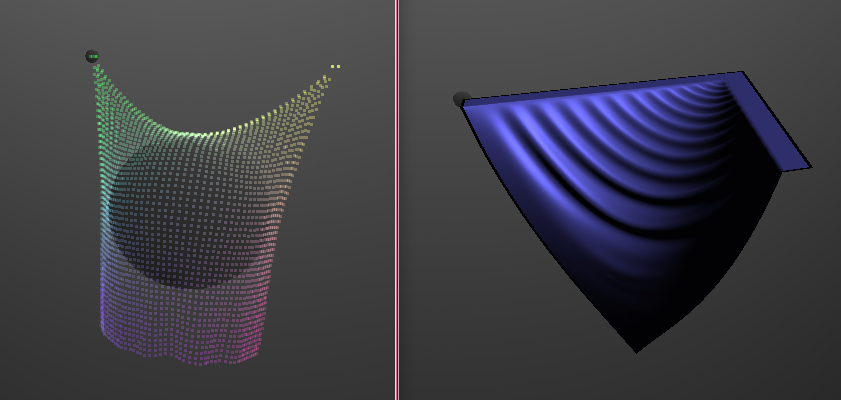	

1. Instructions
--------------------------------------------

### 1.1 How to use

#### 1.1.1 Enable WebGL 2.0

Follow the instruction from [WebGL Wiki](https://www.khronos.org/webgl/wiki/Getting_a_WebGL_Implementation) to enable your browser with WebGL2.

#### 1.1.2 Features

* **WebGL 1.0 & WebGL 2.0**

	If the project is running on browser that supports only WebGL 1.0, there would be a "WebGL Cloth Simulaiton" object in the scene.
Otherwise, if the browser supports WebGL 2.0, there would be "WebGL 2 Cloth Simulation" instead and the simulation is using transform feedback.

	|WebGL 1.0 ScreenShot		|WebGL 2.0 ScreenShot
	|:-------------------------:|:-------------------:
	|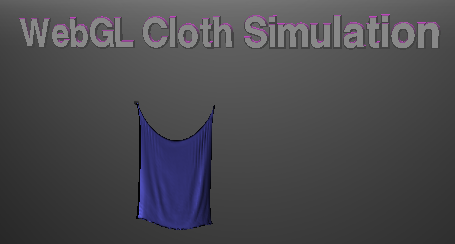		|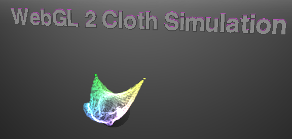

* **Settings and Basic Animation Control**

	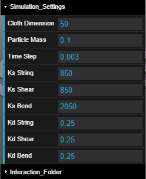|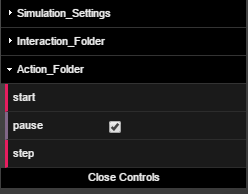

	* **Render Mode**

		|Points						|Triangle
		|:-------------------------:|:-------------------:
		|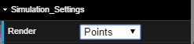|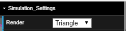
		|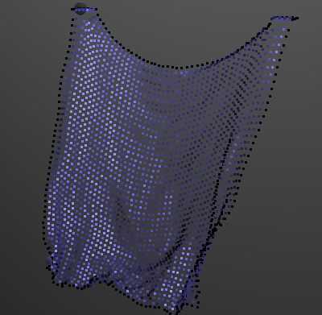		|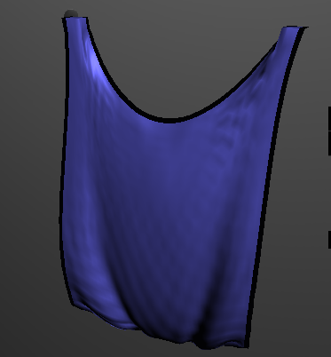

* **Interactions**

	* **RigidBody**

	  

	  Cloth-Rigidbody collision is more stable in WebGL2 implementation than in WebGL1.

	  |WebGL 1.0 Rigidbody		|WebGL 2.0 Rigidbody 
	  |:-------------------------:|:-------------------:
	  |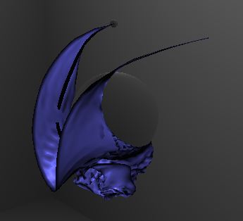		|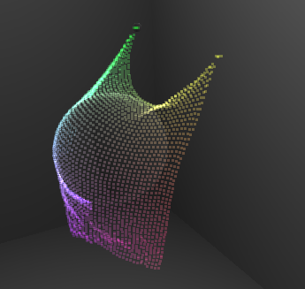

	* **Wind**

	  TODO: add pic here

	* **Pins**

	  There are two kinds of pins: pin points and pin edges. Select them under Interaction_Folder->Edges or ->Pins
	  
	  

	  WebGL 2 version is supporting movable pin.

	  TODO: movable pin gif.

### 1.2 Implementation

#### Ping-ponging Texture

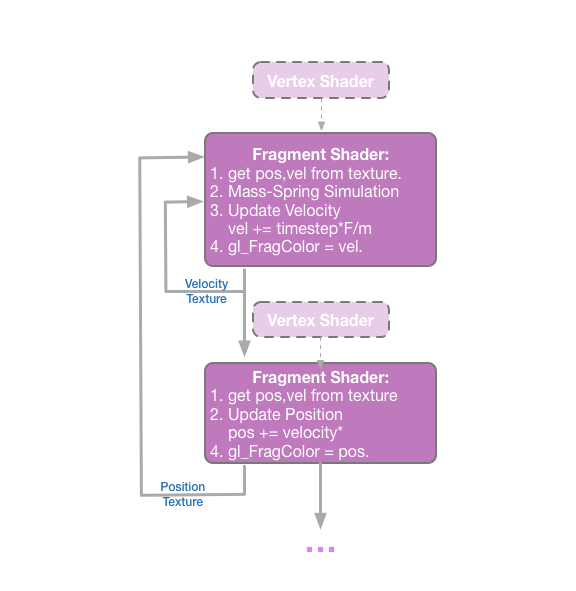

#### Transform Feedback

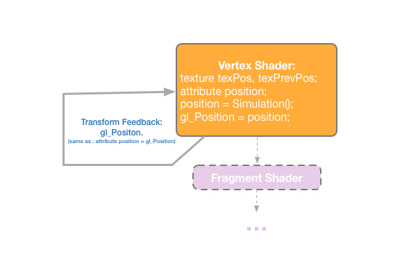

#### Mass-Spring Cloth Simulation

#### Unsolved

* **Different Browsers**

* **Uniform Buffer Object**

2. Performance Analysis
--------------------------------------------

### 2.1 Cloth Dimension (Particle Number)

#### Performance

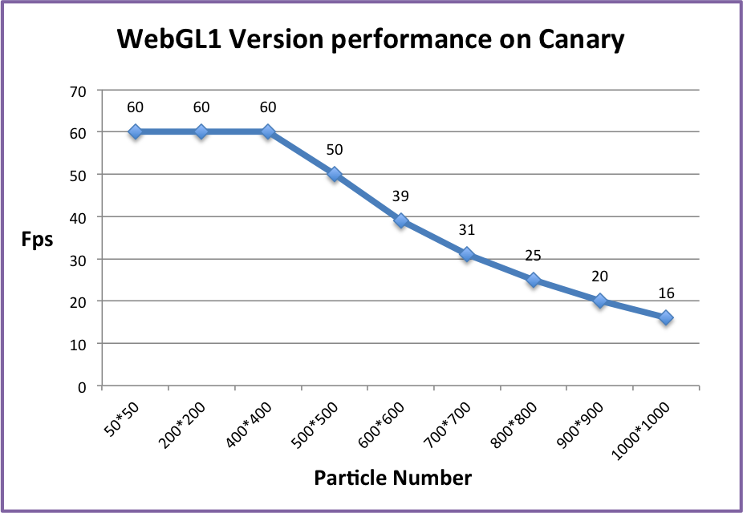

#### Simulation Result

Cloth Dimension could also effect simulation results.

When the mass of single cloth particle is constant. Same set of string parameters could turn into different cloth behavior with differenct particle counts.
Below are clothes with 20*20, 50*50, 100*100 and 150*150 particles respectively and they are simulated with the same set of settings. 

|20*20				|50*50					|100*100				|150*150
|:-------------------:|:---------------------:|:---------------------:|:---------------------:
|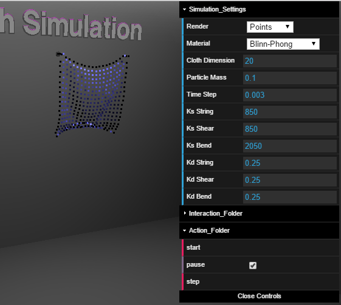	|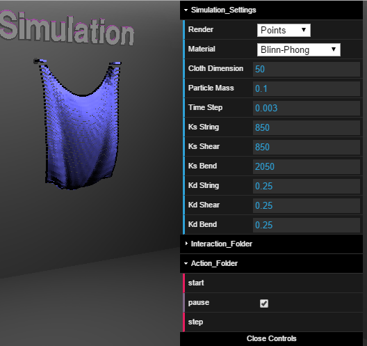	|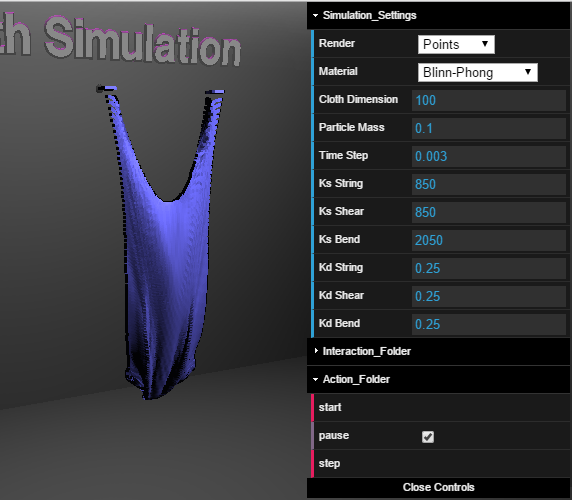	|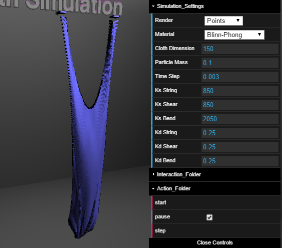

To get the same simulation result as cloth with lower particle count, we need to decrease the value of single particle mass, or increase the value of string parameters.
Either way, a smaller timestep is always needed to ensure a stable system.

|timestep:0.001				|timestep:0.003			
|:-------------------------:|:-------------------------:
|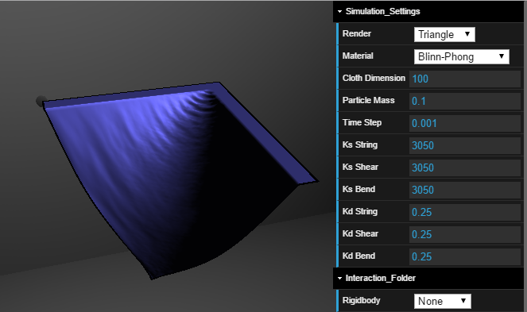	|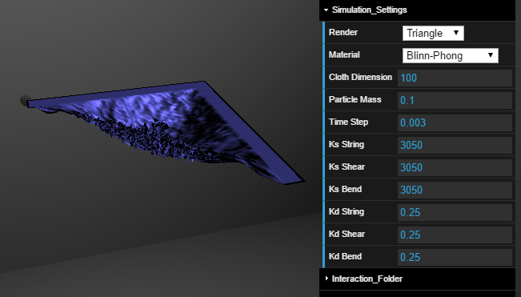	

### 2.2 Code Quality

* WebGL1 version is simulating within fragment shader. Most of the code are through Three.js shaderMaterial. 
WebGL2 version is using transform feedback and doing the simulation in the Vertex Shader. Thus, there are more OpenGL codes and operations.
This makes the WebGL1 version's code more readable and compact.

3.References
--------------------------------------------

[WebGL 2.0 Particles](https://github.com/toji/webgl2-particles)

[OpenGL Insights.Chap 17](http://openglinsights.com/bendingthepipeline.html#RealTimePhysicallyBasedDeformationUsingTransformFeedback)

[Game Engine Gems 2.Chap 22](http://www.crcnetbase.com/doi/abs/10.1201/b11333-25)

