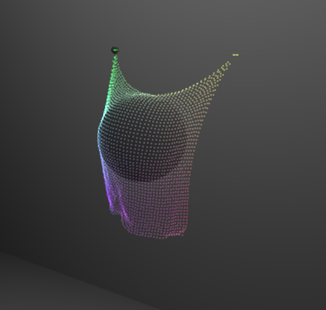

# CIS565-Final-WebGL-Cloth-Simulation

WebGl 2 Cloth-Simulation.
Using Brandon Jones's [WebGL 2 Particle Simulation](https://github.com/toji/webgl2-particles) as framework.

**Feature:**

(1)Implementation of WebGL transform feedback cloth simulation and ping-pong texture method cloth simulation.

(2)Fabric Properties: Pins, pressure, hardness(bending strength), elastic etc.

(3)User interaction with cloth: drag, wind, tear etc.

**Implementation:**

11/16 - Overview Presentation : Basic setup and then start with ping-pong textures.

11/23 - MileStone 1 : WebGL 2 transform feedback.

11/30 - MileStone 2 : Implement fabric properties(pin,pressure, hardness,elastic, etc). (tbd)Environment Lighting.

12/07 - MileStone 3 : Implement user interaction with the cloth (drag, wind, tear etc). (tbd)Sewing seam line.

12/11 - Final : Optimization and Performance Analysis(*particle numbers/fps;*rigid-body interaction etc)
